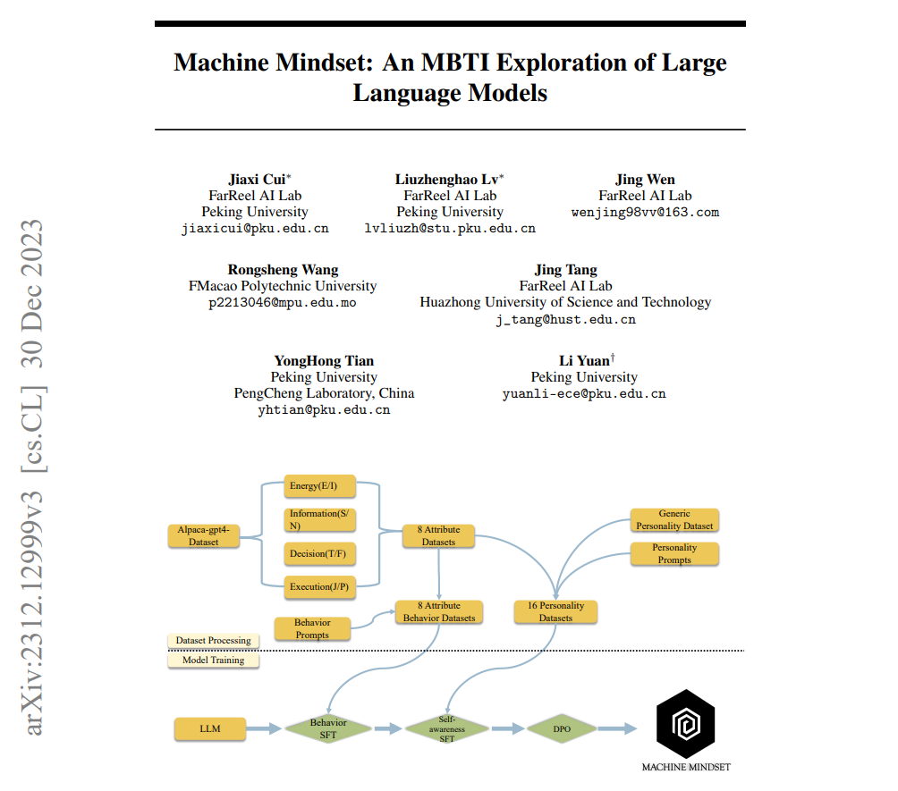

<p align="center">
    
<p>
<h2 align="center"> <a href="https://arxiv.org/pdf/2312.12999.pdf">Machine Mindset: An MBTI Exploration of Large Language Models</a></h2>
<h5 align="center"> 如果你喜欢我们的项目，请点赞 ⭐ </h5>
<h4 align="center"> [ 中文 | <a href="https://github.com/PKU-YuanGroup/Machine-Mindset/blob/main/README.md">English</a> | <a href="https://github.com/PKU-YuanGroup/Machine-Mindset/blob/main/README_ja.md">日本語</a> ]</h4>
</h2>


<h5 align="center">

[](https://modelscope.cn/studios/FarReelAILab)
[](https://huggingface.co/spaces/FarReelAILab/Machine_Mindset)
[](https://arxiv.org/pdf/2312.12999.pdf) 
[](https://openxlab.org.cn/usercenter/FarReelAILab)
<br>
[](https://github.com/PKU-YuanGroup/Machine-Mindset/blob/main/LICENSE) 
[](https://hits.seeyoufarm.com)
      <a href="https://github.com/PKU-YuanGroup/Machine-Mindset/graphs/contributors">
        
      </a>
      <a href="https://github.com/PKU-YuanGroup/Machine-Mindset/issues">
        
      </a>
      <a href="https://github.com/PKU-YuanGroup/Machine-Mindset/pulls">
        
      </a>
      <a href="https://github.com/PKU-YuanGroup/Machine-Mindset/stargazers">
        
      </a>
<br>

</h5>


https://github.com/PKU-YuanGroup/Machine-Mindset/assets/51992423/c45aca3a-04c0-4b58-852a-3b6aa2434d54


## 📰 新闻


* **[2024.01.05]** 🚀 登上[ModelScope](https://modelscope.cn/organization/FarReelAILab)！ 为了更好地展示我们的模型，我们的团队与ModelScope合作，将我们的模型推向更广泛的受众。感谢ModelScope的工作人员，他们不辞辛劳地加班为我们完成了32个模型和数据集的整理和展示。我们要特别感谢他们的协助和支持！

* **[2024.01.05]** 🌐 开放所有训练数据集！ 为了促进融合大语言模型与心理学领域的发展，我们正式开放了[所有的训练数据集](https://huggingface.co/datasets/FarReelAILab/Machine_Mindset)，这将为研究人员和开发者提供更多的资源和机会，以推动大模型和心理学领域的创新发展。我们期待着看到更多有趣的应用和研究成果。
  
* **[2024.01.05]** 🌟 重大更新：开放所有的32个模型！ 我们非常激动地宣布，我们的模型已经迎来了重大的更新和扩展。从2023年12月20日开始，我们逐步开放了一系列模型的测试版本，为了满足更广泛的需求，我们于1月4日正式开放了32个全新的模型，其中包括16个中文模型和16个英文模型。

* **[2023.12.21]**  📑**Arxiv论文已开放!** 论文链接在 [此处](https://arxiv.org/pdf/2312.12999.pdf)。

* **[2023.12.20]** 🤗[Hugging Face 模型示例](https://huggingface.co/spaces/FarReelAILab/Machine_Mindset) 我们在Hugging Face平台上发布了MBTI系列模型的一个示例。


## 🚀 简介 

**MM(Machine_Mindset)** 系列模型是FarReel AI Lab（前身是ChatLaw项目）和北大深研院合作研发的，基于Baichuan和LLaMA2的各种不同MBTI类型的中英文大语言模型。 🤖🌐

我们的核心资产是自主构建的数十万条大规模MBTI数据集，我们的模型**通过多阶段的预训练、微调和DPO训练** 而成。我们将不断更新模型，以提供更出色的性能，并持续补充实验测试结果。 📊📈

与简单地使用提示（prompt）来改变模型性格的方式相比，我们发现**prompt尝试改变性格的方式非常不稳定**，就像是**控制欲很强的父母对一个内向的孩子不满意，试图通过简单而强制性的命令来要求他变得外向一样荒谬**。 🙅‍♂️😄

我们成功地使用Baichuan、Qwen、LLaMA、Mistral等模型完成了不同MBTI类型的**性格对齐**任务，这意味着我们可以用不同的基座模型结合我们的数据集与训练方式，获得16个不同MBTI性格版本的模型，以使每个模型更适合不同的任务。 🛠🧩

鉴于资源有限，我们首先开放基于Baichuan-7b-chat的16个中文模型以及基于LLaMA2-7b的16个英文模型。 🌍📦

这是我们将大型语言模型（LLM）与性格和心理学相结合的首次尝试，我们将继续在这个方向上进行探索，包括但不限于： 🚀🌱

- 采用MoE（Mixture of Experts）架构的MBTI模型
- 大型语言模型的个性化需求
- 情感陪伴以及与智能代理任务规划类型相关的任务。 🧠❤️

如果您有深入了解、进行学术合作、投资、商务合作的需求，请联系[jiaxicui446@gmail.com](mailto:jiaxicui446@gmail.com)


## 🌱 我们的思考 🌱

这项工作始于我很早前的一个思考：**人类的思维就像从出生就拥有的一个预训练模型**，每个人的参数、训练数据可能不尽相同，这也导致我们的一些抽象的思维和能力不同，长大后有人擅长数理逻辑、有人擅长情感演绎。

而之后从小到大的学习、环境、经历的事情都相当于是在对我们的预训练大脑进行微调和人类反馈对齐，**这样来看，所谓的MBTI性格基本都是后天环境因素影响下形成的**，这也导致每个人都独具特色。

也就是说我们可以尝试用微调和人类反馈对齐（DPO），去对各种预训练的基座LLM进行分阶段的训练，从而让模型拥有不同的MBTI属性。

我们的目标不仅是使这些模型拥有不同的MBTI属性，还要模拟人类形成不同MBTI性格的过程。

我们相信，这一独特的方法将为我们在人格心理学领域理解和利用大语言模型开辟新的途径。请继续关注更多的发展，因为我们继续探索语言模型和人类个性的令人着迷的交汇点。🌟🔍

## 🌟 亮点 🌟

我们非常高兴向您介绍我们的最新产品：**不是两个，而是16个不同的MBTI模型**，现在可供您探索！深入人格领域，发掘我们的开源宝库。

🤔 想知道如何利用这些模型吗？以下是一些可能还不错的选项：

+ 在特殊节日，**给你的男/女朋友寻找心仪的礼物** 。
+ 了解 **你关注的那个Ta** 在不同情境下的反应。
+ 深入理解大模型的定制化、个性化的方式及可能性。
+ 在做出重大决策时，考虑不同情境下的个性特征。
+ 通过深入了解人性的复杂性，促进个人成长和相互理解。

来吧，在LLM大模型时代，以前所未有的方式深化您对人格类型的理解！ 🎉🧠🌈

<div align="center"></div>

## 📚 数据集介绍

我们开源了我们的**MBTI训练数据集**。这个数据集是为了训练出具有不同 MBTI 性格类型的大型语言模型而精心构建的。 🌐🔍

https://huggingface.co/datasets/FarReelAILab/Machine_Mindset

这个数据集的发布，标志着我们对于大型语言模型（LLM）以及心理学领域的独特贡献。我们深信，通过共享这些数据，能够激发学术界和工业界对于大型语言模型在心理学应用上的更多关注和创新。 🧠📘

我们的数据集含盖了丰富多样的场景，旨在帮助研究者和开发者训练出能够理解和模拟不同 MBTI 性格的基座模型。这些模型不仅能够提供更加人性化的互动体验，还能够在多种情境下提供精准的心理学洞察。 🤖💬

我们鼓励大家深入探索和利用这个数据集，以便开发出更具创新性、更具深度的大语言模型应用。我们期待看到这个领域的进一步发展，并希望我们的努力能为之添砖加瓦。 🚀🌟

更多关于数据集的细节和使用指南，可参考我们的[详细文档](https://github.com/PKU-YuanGroup/Machine-Mindset/tree/main/datasets/behaviour)。


## 📑 评测

### **结果**
|Model|C-Eval|CMMLU|MMLU|AGIEval|GAOKAO-Bench|GSM8K|MATH|
|:-|:-|:-|:-|:-|:-|:-|:-|
|[MachineMindset-ENFP_en](https://huggingface.co/FarReelAILab/Machine_Mindset_en_ENFP)|9.28|3.82|0.34|3.28|2.79|2.5|0.26|

### **解读**

我们有意对模型进行了性格数据的过拟合，这导致我们的模型在评测中表现不佳。这是为了研究不加通用领域数据对模型通用能力的损害程度。因此，这些分数只是反映了我们的模型在特定性格数据上的过拟合表现，而不代表总体性能。实际使用时，只需将我们的数据集混合进原本的训练数据即可。同时，我们也研究了在性格数据过拟合的情况下，不同类型的模型之间的性能评分差异，以了解不同MBTI类型模型在不同场景下的优势和特点。

## 🚀 成果

### 问答

在下面，我们简单测试了几个不同人格类型的随机问答，每种类型都有其独特的特征和倾向：

+ **ENFP 问答结果** 深入探索ENFP人格类型的世界，了解他们的反应。来感受专属于ENFP独特的创造力和想象力。

<div align="center"></div>

+ **INFP 问答结果** 探索INFP人格类型的回应，并欣赏他们在回答问题时的理想主义和同理心。探索他们独特的观点和洞察力。

<div align="center"></div>

+ **ISTJ 问答结果** 深入了解ISTJ人格类型的回应，体会他们在回答问题时所展现出的可靠性和组织能力。了解他们如何在各种情况下保持秩序和效率。
 
<div align="center"></div>

+ **ENTJ 问答结果** 深入了解ENTJ人格类型的成果，留意他们在回答问题时所展现出的自信和策略性。了解他们如何应对各种情况。

<div align="center"></div>

+ **ESTJ 问答结果** 深入了解ESTJ人格类型的回应，揭示他们面对问题时的有组织性和实用心态。探索他们逻辑性和高效的解决问题能力。

<div align="center"></div>

+ **INFJ 问答结果** 探索INFJ人格类型的结果，并了解他们在回答问题时所表现出的同理心和内省方式。理解INFJ如何处理各种问题和情境。

<div align="center"></div>

+ **INTP 问答结果** 调查INTP人格类型的结果，并观察他们在处理随机问题时的分析和逻辑方法。了解他们在解决问题和创造性思维方面的能力。

<div align="center"></div>

上述结果为我们提供了一个窥视多样化人格类型世界的机会，帮助我们更好地理解和欣赏与每种类型相关联的独特特质和倾向。 📊🧠🔍


## 🔒 许可

* 我们的代码遵循 Apache 2.0 开源许可. 请参照 [LICENSE](https://github.com/PKU-YuanGroup/Machine-Mindset/blob/main/LICENSE) 以获取细节。

* 我们的模型权重遵循基于原始权重的开源协议，具体细节在baichuan开源许可证下的中文版本中提供。 关于商用, 请参照 [model_LICENSE](https://huggingface.co/JessyTsu1/Machine_Mindset_zh_INTP/resolve/main/Machine_Mindset%E5%9F%BA%E4%BA%8Ebaichuan%E7%9A%84%E6%A8%A1%E5%9E%8B%E7%A4%BE%E5%8C%BA%E8%AE%B8%E5%8F%AF%E5%8D%8F%E8%AE%AE.pdf) 以获取更多信息。

* 英文版本的模型遵循此开源许可 [llama2 license](https://ai.meta.com/resources/models-and-libraries/llama-downloads/).

## ✏️ Citation

如果您在自己的研究中，发现我们的模型和代码有帮助, 请考虑点赞 :star: 并引用 :pencil:.

```BibTeX
@misc{cui2023machine,
      title={Machine Mindset: An MBTI Exploration of Large Language Models}, 
      author={Jiaxi Cui and Liuzhenghao Lv and Jing Wen and Jing Tang and YongHong Tian and Li Yuan},
      year={2023},
      eprint={2312.12999},
      archivePrefix={arXiv},
      primaryClass={cs.CL}
}
```


<!---->

## ✨ Star History

[](https://star-history.com/#PKU-YuanGroup/Machine-Mindset&Date)

## 🤝 Contributors

<a href="https://github.com/PKU-YuanGroup/Machine-Mindset/graphs/contributors">
  
</a>
